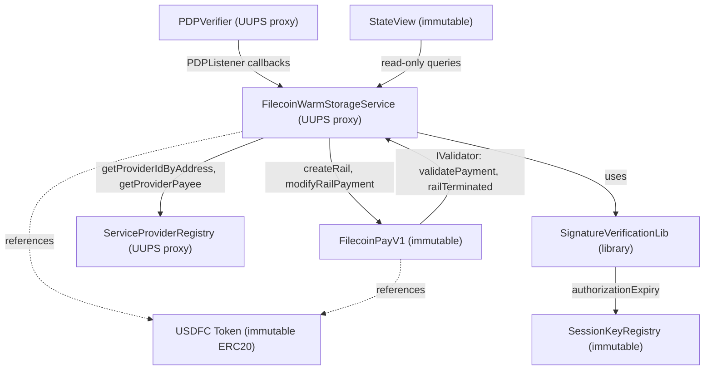
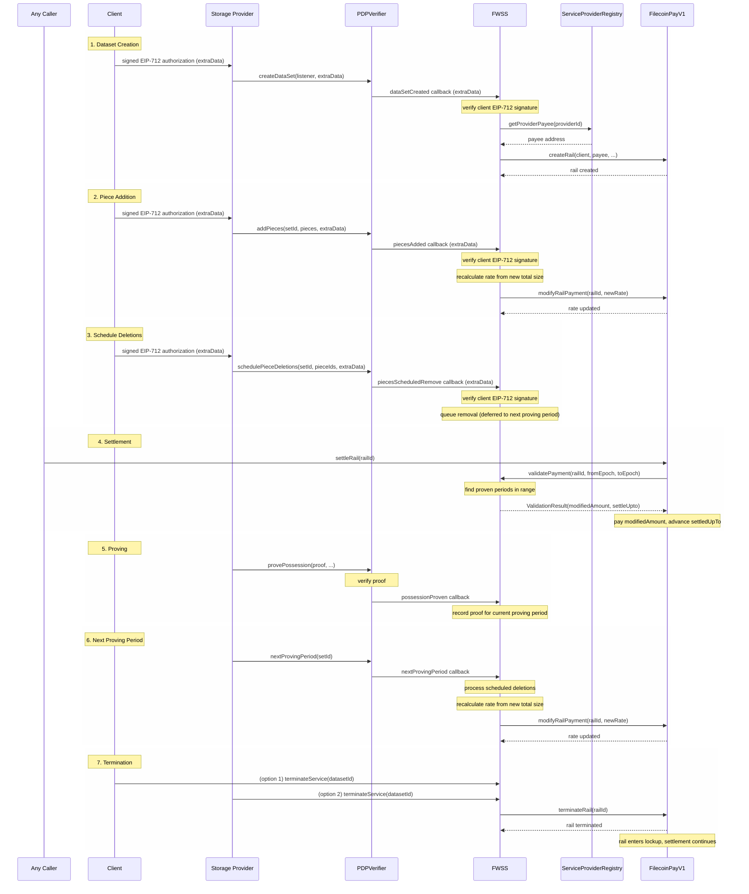

# Filecoin Services Specification

## Pricing

### Pricing Model

FilecoinWarmStorageService uses **static global pricing**. All payment rails use the same price regardless of which provider stores the data. The default storage price is 2.5 USDFC per TiB/month.

Providers may advertise their own prices in the ServiceProviderRegistry, but these are informational for other services, and does not affect actual payments in FilecoinWarmStorageService.

### Rate Calculation

The payment rate per epoch is calculated from the total data size in bytes:

```
# Constants
EPOCHS_PER_MONTH              = 86400         # 2880 epochs/day × 30 days
TiB                           = 1099511627776 # bytes

# Default pricing (owner-adjustable)
pricePerTiBPerMonth           = 2.5 USDFC
minimumStorageRatePerMonth    = 0.06 USDFC

# Per-epoch rate calculation
sizeBasedRate = totalBytes × pricePerTiBPerMonth ÷ TiB ÷ EPOCHS_PER_MONTH
minimumRate   = minimumStorageRatePerMonth ÷ EPOCHS_PER_MONTH
finalRate     = max(sizeBasedRate, minimumRate)
```

The default minimum floor ensures datasets below ~24.58 GiB still generate the minimum payment of 0.06 USDFC/month.

**Precision note**: Integer division when computing `minimumRate` causes minor precision loss. The actual monthly payment (`minimumRate × EPOCHS_PER_MONTH`) is slightly less than `minimumStorageRatePerMonth`—under 0.0001% for typical floor prices. This is acceptable; see the lockup section below for how pre-flight checks handle this.

### Pricing Updates

Only the contract owner can update pricing by calling `updatePricing(newStoragePrice, newMinimumRate)`. Maximum allowed values are 10 USDFC for storage price and 0.24 USDFC for minimum rate.

**Effect on existing datasets**: Pricing changes do not immediately update rates for existing datasets. New rates take effect when pieces are next added or removed. This avoids gas-expensive rate recalculations across all active datasets while ensuring new pricing applies to all future storage operations.

### Rate Update Timing

Rate recalculation timing differs for additions and deletions due to proving semantics:

- **Adding pieces**: The rate updates immediately when `piecesAdded()` is called. The client begins paying for new pieces right away, even though those pieces won't be included in proof challenges until the next proving period. This fail-fast behavior protects providers: if the client lacks sufficient funds for the new lockup, the transaction fails before the provider commits resources.

- **Removing pieces**: Deletions are scheduled and take effect at the next proving boundary (`nextProvingPeriod()`). The client continues paying the existing rate until the removal is finalized. This deferral is required because proofs may challenge any portion of the current data set during the proving period—the provider must continue storing and proving all existing data until the period ends.

**Why the asymmetry?**

During each proving period, proofs are generated over a fixed data set. The prover must maintain the complete data set because challenges can target any leaf:

- **Additions expand the proof space** but don't affect existing challenges. New pieces simply won't be challenged until the next period. Payment starts immediately because storage resources are committed.

- **Deletions would shrink the proof space** mid-period, potentially invalidating challenges. The data must remain intact until `nextProvingPeriod()` finalizes the removal. Only then does the rate decrease.

This ensures proof integrity while providing fair payment semantics: you pay when you add, and continue paying for deletions until the proving period boundary.

### Rate Changes After Termination

When a service is terminated (by client or provider), the payment rail enters a lockup period during which funds continue flowing to the provider. Rate change behavior differs from active rails:

- **Additions are blocked**: `piecesAdded()` reverts after termination. No new pieces can be added to a terminated dataset.

- **Deletions are allowed**: Piece removals can still be scheduled during the lockup window via `piecesScheduledRemove()`, and take effect at the next proving boundary.

- **Rate can only decrease or stay the same**: Since additions are blocked, the only size changes come from deletions. FilecoinPay enforces `newRate <= oldRate` on terminated rails—rate increases are rejected with `RateChangeNotAllowedOnTerminatedRail`.

This design ensures the provider receives payment at or above the rate established before termination. The lockup period guarantees payment for the agreed service level, while still allowing the client to reduce their data footprint (and rate) through deletions.

### Funding and Top-Up

Clients pay for storage by depositing USDFC into the Filecoin Pay contract. These funds flow to providers over time based on the storage rate.

**Lockup**: To protect providers from non-payment, FWSS requires clients to maintain a 30-day reserve of funds. This "lockup" guarantees the provider will be paid for at least 30 days even if the client stops adding funds. The lockup is not a pre-payment—funds still flow to the provider gradually—but it cannot be withdrawn while the storage agreement is active.

```
lockupRequired = finalRate × EPOCHS_PER_MONTH
```

At minimum pricing, this equals `minimumStorageRatePerMonth` (0.06 USDFC at default settings). For larger datasets, the lockup equals one month's storage cost.

**Pre-flight check precision**: The pre-flight validation uses a multiply-first formula `(minimumStorageRatePerMonth × EPOCHS_PER_MONTH) ÷ EPOCHS_PER_MONTH` which preserves the exact monthly value. This produces cleaner error messages (the configured floor price rather than a value with precision loss artifacts) and is slightly more conservative than the actual rail lockup. The difference is under 0.0001% and always in the user's favor—they are never required to have less than needed.

**Storage duration** extends as clients deposit additional funds:

```
storageDuration = availableFunds ÷ finalRate
```

Deposits extend the duration without changing the rate (unless adding pieces triggers an immediate rate recalculation, or scheduled deletions take effect at the next proving boundary).

**Delinquency**: When a client's funded epoch falls below the current epoch, the payment rail can no longer be settled—no further payments flow to the provider. The provider may terminate the service to claim payment from the locked funds, guaranteeing up to 30 days of payment from the last funded epoch.

## Settlement and Payment Validation

### Proving Period Epoch Conventions

Proving periods use **exclusive-inclusive** epoch ranges. The activation epoch (set when `nextProvingPeriod()` is first called) is a boundary marker, not a billable epoch.

With activation epoch `A` and period length `M` (maxProvingPeriod, e.g. 2880 for a 1-day proving period):

```
Period 0: epochs (A,   A+M]         (billable epochs A+1 through A+M)
Period 1: epochs (A+M, A+2M]        (billable epochs A+M+1 through A+2M)
Period N: epochs (A+N*M, A+(N+1)*M]
```

The **deadline** for period N is `A + (N+1)*M`, the last epoch of the period, and the last epoch at which a proof can be submitted.

The formula `(epoch - A - 1) / M` maps an epoch to its period number. The `- 1` shifts from inclusive-exclusive `[A, A+M)` to exclusive-inclusive `(A, A+M]` ranges, so the deadline epoch belongs to its own period rather than the next. The activation epoch itself returns an invalid sentinel (`type(uint256).max`) because `epoch < activationEpoch` after the subtraction underflows.

Using the same logic, settlement ranges also use exclusive-inclusive `(fromEpoch, toEpoch]`. The settlement `fromEpoch` should be the last settled epoch, and the range is treated as exclusive of that epoch. `fromEpoch` is also clamped up to `A`, so any `fromEpoch <= A` results in the first billable epoch being `A+1`. `toEpoch` is the last epoch to settle, and the range is treated as inclusive of this epoch.

### Settlement Rules (Proven / Faulted / Open)

`validatePayment()` is called by FilecoinPay during `settleRail()`.

Settlement progress (`settledUpTo`) tracks the epoch up to which payments have been processed. `validatePayment()` determines how far settlement can advance and how much payment is due.

Because payment amount is tied to successfully submitted proofs, it's possible for period can advance `settleUpTo` while contributing zero to the payment.

Each proving period is in one of three states:

- **Proven**: Period has a valid proof. Settlement advances and payment is proportional to proven epochs.
- **Faulted**: Deadline has passed with no proof. Settlement advances but payment is zero.
- **Open**: Deadline has not yet passed, no proof. Settlement is blocked at the period boundary because the provider may still submit a proof.

### Partial-Period Settlement (FilecoinPay Rate Changes)

Where base rail rate changes have occurred (e.g. pieces were added mid-period, changing the payment rate), FilecoinPay settles each rate "segment" independently (see `_settleWithRateChanges`). Each segment gets its own `validatePayment()` call with a `toEpoch` that may fall anywhere within a proving period. So `validatePayment()` must be able to handle settlement of near-arbitrary ranges (see `_findProvenEpochs`).

### Settlement Algorithm (_findProvenEpochs)

The function iterates through each proving period that overlaps the settlement range `(fromEpoch, toEpoch]`, applying the proven/faulted/open rules uniformly to each. Partial periods at the start and end of the range are handled by clamping: each period contributes epochs from `max(periodStart, fromEpoch)` to `min(toEpoch, deadline)`. Only the last period in the range can be open — since `toEpoch <= block.number`, all earlier periods' deadlines have necessarily passed.

`validatePayment()` signals the final settlement epoch to FilecoinPay, which is recorded as `settledUpTo` on the rail. The next setllement call uses this as its `fromEpoch`, so settlement progresses incrementally. The provider is paid proportional to the number of proven epochs within the range requested for settlement by FilecoinPay, whether that range covers multiple periods, or a partial period due to rate change segmentation.

### Settlement During Lockup

After termination, the payment rail enters a lockup period. Settlement continues normally during this time:

- If the provider proves all periods, they receive full payment
- If the provider fails to prove some periods, those epochs receive zero payment
- If the provider abandons entirely, settlement advances with zero payment once all deadlines pass

The client's locked funds are released proportionally as settlement progresses. Unproven epochs result in funds returning to the client rather than flowing to the provider.

### Dataset Deletion Requirements

Dataset deletion (`dataSetDeleted`) requires the payment rail to be fully settled before the dataset can be removed:

```
require(settledUpTo >= endEpoch, RailNotFullySettled)
```

**Rationale**: The `validatePayment()` callback reads dataset state (proving status, periods proven) to calculate payment amounts. If the dataset is deleted before settlement completes, `validatePayment()` cannot function, forcing clients to use `settleTerminatedRailWithoutValidation()` which pays the full amount regardless of proof status.

**Implications**:

- Providers must wait for settlement to complete before deleting datasets
- Clients can always settle rails (with zero payment for unproven periods) once deadlines pass
- Dataset deletion timing is controlled by proving period deadlines, not just the lockup period

**Timing**: To delete a dataset after termination:
1. Wait for `block.number > pdpEndEpoch` (lockup period elapsed)
2. Wait for all proving period deadlines within the lockup to pass
3. Call `settleRail()` to complete settlement (rail may auto-finalize)
4. Call `deleteDataSet()` to remove the dataset

## CDN Payment Rails

Datasets with CDN support have three payment rails: a **PDP rail** for storage proving, and two **CDN rails** for content delivery:

- **Cache-miss rail** (`cacheMissRailId`): Pays to the storage provider (SP) for origin fetches
- **Bandwidth rail** (`cdnRailId`): Pays to the FilBeam beneficiary address (immutably set at deployment)

Both CDN rails have `paymentRate = 0` and use fixed lockup for one-time payments based on usage.

### Payment Models

PDP and CDN rails use fundamentally different payment models:

**PDP rail**: Uses proof-based settlement. FWSS acts as validator, receiving callbacks to verify that storage proofs were submitted before authorizing payment. Settlement amounts depend on proving status.

**CDN rails**: Use usage-based settlement via one-time payments. No validator is set. The FilBeam controller calculates payment amounts based on actual egress metrics and calls `settleFilBeamPaymentRails()` on FWSS, which executes one-time payments from the fixed lockup. This decouples CDN payment logic from the proof-based model used for storage.

### CDN Rail Operations

**Top-up**: Clients call `topUpCDNPaymentRails()` on FWSS to increase their CDN fixed lockup, which extends their egress allowance.

**Settlement**: The FilBeam controller calls `settleFilBeamPaymentRails()` on FWSS to execute one-time payments based on usage data. This is the intended settlement path.

**Termination**: The intended path is `terminateCDNService()` on FWSS, which terminates both CDN rails and clears the `withCDN` metadata.

### Direct FilecoinPay Access

Because CDN rails have no validator, FilecoinPay permits the payer to call `terminateRail()` directly. Since CDN rails have `paymentRate = 0`, the payer's lockup is effectively always settled, so this is always permitted. Direct `settleRail()` calls are also permitted but would be a no-op since there's no streaming rate to settle. This is a constraint of FilecoinPay's design, not the intended usage path.

### CDN Metadata Synchronization

FWSS tracks CDN-enabled datasets using a `withCDN` metadata key. This metadata is set when CDN rails are created and deleted when CDN service is terminated through FWSS.

If CDN rails are terminated directly via FilecoinPay (bypassing FWSS), the `withCDN` metadata remains set because FWSS receives no callback. This creates an out-of-sync state where FWSS believes CDN is active but the underlying rails are terminated or finalized. Subsequent CDN operations (`topUpCDNPaymentRails`, `settleFilBeamPaymentRails`) will fail when they attempt to interact with the inactive rails.

**Note**: There is currently no mechanism to clean up orphaned `withCDN` metadata. The practical impact is limited since `terminateService()` uses best-effort CDN termination (ignoring errors), so full service termination still succeeds.

### Service Termination

When terminating a dataset's service, FWSS terminates the PDP rail (which it validates) and performs best-effort termination of CDN rails, ignoring any errors. This ensures service termination succeeds regardless of CDN rail state—whether rails are active, already terminated, or fully settled and finalized.

## Contract Architecture

FWSS is composed of multiple independently-deployed contracts connected by on-chain references. Understanding the coupling between these contracts is essential for reasoning about upgradeability, failure recovery, and migration.

### System Diagram



Solid arrows indicate call direction. Dashed arrows indicate token references. Bidirectional arrows between FWSS and FilecoinPayV1 reflect the callback pattern: FWSS calls FilecoinPayV1 to manage rails, and FilecoinPayV1 calls back into FWSS (as an IValidator) during settlement and termination.

### Contract Inventory

| Contract | Upgradeable? | Pattern | Key Role |
|---|---|---|---|
| FilecoinWarmStorageService | Yes | UUPS proxy | Orchestrator — manages datasets, pricing, proving lifecycle, and payment rail operations |
| PDPVerifier | Yes | UUPS proxy | Proof-of-data-possession verification; drives dataset lifecycle via PDPListener callbacks |
| ServiceProviderRegistry | Yes | UUPS proxy | Registry of providers, their capabilities, and payee addresses |
| FilecoinPayV1 | No | Immutable | Payment rails engine — deposits, lockups, streaming settlement, rate changes |
| SessionKeyRegistry | No | Immutable | Session key authorization; maps (user, signer, permission) → expiry |
| StateView | No | Immutable | Read-only view contract for efficient external state queries against FWSS |
| SignatureVerificationLib | No | External library | EIP-712 signature recovery and session key validation |
| [USDFC Token](https://docs.secured.finance/usdfc-stablecoin/overview) | No | Immutable ERC20 | External stablecoin; payment token for all storage and CDN settlements |

### Upgrade Mechanism

FWSS, PDPVerifier, and ServiceProviderRegistry follow the Universal Upgradeable Proxy Standard (UUPS, [ERC-1822](https://eips.ethereum.org/EIPS/eip-1822)), a proxy pattern where the upgrade logic lives in the implementation contract rather than the proxy. The proxy delegates all calls to the current implementation, and only the implementation can authorize a switch to a new one. See the [OpenZeppelin UUPS guide](https://docs.openzeppelin.com/contracts/5.x/api/proxy#UUPSUpgradeable) for details.

On top of the standard UUPS pattern, all three contracts implement the same home-grown **two-step announce-then-upgrade** pattern. The owner first calls `announcePlannedUpgrade(PlannedUpgrade)` with the address of the new implementation (`PlannedUpgrade.nextImplementation`) and a future block number (`PlannedUpgrade.afterEpoch`). The upgrade cannot execute until that block number is reached.  The minimum delay is at least 1 block.  When [`upgradeToAndCall`](https://docs.openzeppelin.com/contracts/5.x/api/proxy#UUPSUpgradeable-upgradeToAndCall-address-bytes-) is later invoked, the internal `_authorizeUpgrade` guard verifies the implementation matches the announcement and the delay has elapsed:

```solidity
function announcePlannedUpgrade(PlannedUpgrade calldata plannedUpgrade) external onlyOwner {
    require(plannedUpgrade.nextImplementation.code.length > 3000); // Prevent accidental upgrades to empty or trivially small implementations.
    require(plannedUpgrade.afterEpoch > block.number); // plannedUpgrade.afterEpoch  must be at least one block later than `block.number`.  The delay is intended to give users time to review the announced implementation before it takes effect.
    nextUpgrade = plannedUpgrade;
    emit UpgradeAnnounced(plannedUpgrade);
}

function _authorizeUpgrade(address newImplementation) internal override onlyOwner {
    require(newImplementation == nextUpgrade.nextImplementation);
    require(block.number >= nextUpgrade.afterEpoch);
    delete nextUpgrade;
}
```
_(This is from [`FilecoinWarmStorageService.sol:429-441`](https://github.com/FilOzone/filecoin-services/blob/main/service_contracts/src/FilecoinWarmStorageService.sol#L429-L441).)_

A successful `_authorizeUpgrade` call will enable the old implementation to set the `newImplementation` address on the proxy, effectively completing the upgrade.

### Immutable Reference Coupling

The FWSS constructor sets several **immutable addresses** that are baked into the implementation bytecode at deploy time:

- `pdpVerifierAddress` — PDPVerifier proxy
- `paymentsContractAddress` — FilecoinPayV1
- `usdfcTokenAddress` — [USDFC token](https://docs.secured.finance/usdfc-stablecoin/deployed-contracts) (external)
- `filBeamBeneficiaryAddress` — CDN beneficiary
- `serviceProviderRegistry` — ServiceProviderRegistry proxy
- `sessionKeyRegistry` — SessionKeyRegistry

Because these are Solidity `immutable` variables, they live in the deployed bytecode rather than in proxy storage. In a UUPS proxy, upgrading the implementation contract replaces the bytecode, so a new implementation can carry different immutable values. Changing any reference therefore requires deploying a new implementation and executing the [two-step upgrade](#upgrade-process).

**Proxy vs. non-proxy references.** References to proxy contracts (PDPVerifier, ServiceProviderRegistry) are **resilient**: those contracts upgrade their own logic independently without requiring any change to FWSS. The FWSS immutable address points at the proxy, which remains stable across upgrades.

References to non-proxy contracts (FilecoinPayV1, SessionKeyRegistry) are **rigid**: replacing them requires a new FWSS implementation carrying the new address, plus the two-step upgrade. State held in the old contract (rail balances, lockups, session key authorizations) is **orphaned** — it cannot be migrated automatically and must be handled explicitly.

**StateView reference.** Unlike the references above, FWSS holds its StateView address in a **storage variable** (`viewContractAddress`), not an immutable. The owner can update it at any time via `setViewContract()` without an FWSS upgrade. It can also be set during an upgrade via the `migrate()` function. External callers (e.g., Synapse) discover the current StateView by reading `viewContractAddress()` from the FWSS proxy.

### Data Flows

The following sequences describe the primary cross-contract call paths.



## Failure Scenarios and Migration Strategy

Each contract in the system could contain a flaw — a logic bug, storage corruption, or an exploitable vulnerability. The impact of a flaw and the available remediation options depend on whether the contract is upgradeable and how tightly it is coupled to the rest of the system. This section frames the analysis for each component; concrete migration mechanisms are marked as TODOs pending further design work.

### PDPVerifier

PDPVerifier is currently a UUPS proxy. The long-term goal is for PDPVerifier to become immutable once the contract has been sufficiently hardened, but at this stage upgradeability is retained to allow correcting security bugs without redeploying the entire system.

Most flaws in PDPVerifier logic can be corrected by deploying a new implementation and executing the two-step upgrade. Because FWSS holds an immutable reference to the PDPVerifier proxy address (not the implementation), the upgrade is **transparent to FWSS** — no changes to FWSS are required.

**When a PDPVerifier fix requires a new FWSS implementation.** Not all fixes are transparent. FWSS implements the `PDPListener` callback interface (defined in PDPVerifier's codebase) and calls `IPDPVerifier.getDataSetLeafCount()` on PDPVerifier directly. If a fix requires changing the `PDPListener` callback signatures, adding new required callback methods, or altering shared types like `Cids.Cid`, FWSS must also be upgraded with a new implementation that matches the updated interface. In these cases, both upgrades must be coordinated.

**Impact assessment.** A PDPVerifier bug could corrupt proof records or allow invalid proofs, which would propagate incorrect settlement amounts through FWSS. Proxy storage persists across upgrades, so any storage corruption introduced by the flaw survives the fix. If the bug wrote incorrect data to storage slots, a post-upgrade migration step may be needed to repair the corrupted state.

**TODO:** Define emergency pause procedures for PDPVerifier. Document storage repair patterns for correcting corrupted proof records after an upgrade.

### FilecoinPayV1

FilecoinPayV1 is **not upgradeable**. It holds all payment rail state: balances, lockups, rate change queues, and settlement progress. A flaw in FilecoinPayV1 is the **hardest to remediate** because there is no in-place upgrade path. The response depends on severity:

**Logic bug or feature gap (incorrect settlement, rate miscalculation, new capability needed).** Deploy FilecoinPayV2, then upgrade FWSS to a **dual-reference implementation** carrying both FilecoinPayV1 and FilecoinPayV2 as immutable references. The new FWSS routes existing rails to v1 and new rails to v2. Existing v1 rails drain naturally through normal settlement and termination — no forced migration. An **opt-in migration path** allows clients and SPs to agree (with signed/verified authorization) to move to new rails: on-chain this means creating new datasets and rails in v2 pointing to the same data on the SP, then terminating the old v1 rails. This is more dramatic on-chain than it is to the user — from the client's and SP's perspective, accounting simply moves over. Users must re-approve USDFC spending allowances for the new contract.

**Catastrophic bug (funds at risk, exploitable).** The worst case. Emergency action may be required on v1 rails before the dual-reference approach can be deployed. Funds locked in existing rails must be settled or recovered from the old contract, potentially under time pressure.

**TODO:** Define emergency response procedures for the catastrophic case. Key decisions include: whether an emergency pause or withdrawal mechanism should be built into FilecoinPayV1 proactively, how to handle rails in mid-lockup under adversarial conditions, and emergency response timelines.

### FilecoinWarmStorageService

FWSS is a UUPS proxy. Most flaws in its logic can be corrected by deploying a new implementation and executing the two-step upgrade. Proxy storage (datasets, proving state, metadata) is preserved across upgrades.

**Impact assessment.** Because the constructor sets immutable references, a new implementation can simultaneously fix logic and change any contract reference (e.g., pointing to a new FilecoinPayV2 or SessionKeyRegistry). This makes FWSS the **pivot point** for system-wide migrations. However, storage layout must remain compatible between implementations — adding or reordering storage variables incorrectly can corrupt all persisted state.

**When a new implementation is not enough.** Several scenarios require more than a simple implementation swap:

- **Proxy storage corruption.** If a bug corrupts critical proxy storage slots — the ERC1967 implementation slot, the OwnableUpgradeable owner slot, or the Initializable version counter — the proxy can become permanently non-upgradeable. For example, if the owner is set to `address(0)`, the `onlyOwner` guard on `_authorizeUpgrade` rejects all callers, and no further upgrades can be authorized. Recovery would require deploying an entirely new FWSS proxy and migrating state.

- **IValidator interface constraint.** FilecoinPayV1 is immutable and calls FWSS through the `IValidator` interface (`validatePayment`, `railTerminated`). A new FWSS implementation must remain backwards-compatible with the existing `IValidator` signatures because FilecoinPayV1 cannot be updated. If a fix fundamentally requires changing the validation interface, it cannot be deployed without also replacing FilecoinPayV1.

- **Inherited storage corruption.** A new implementation inherits the proxy's existing storage. If a bug corrupted FWSS storage (e.g., the `railToDataSet` mapping or `DataSetInfo` entries), the new implementation inherits the corrupted data. Mismatches between FWSS state and FilecoinPayV1 rail state are particularly difficult because the FilecoinPayV1 side cannot be corrected. A new implementation can include migration logic to repair FWSS-side storage, but any state baked into FilecoinPayV1 rails (payee, token, validator address) is permanent.

**TODO:** Define post-upgrade data consistency checks. Document storage layout compatibility requirements and testing procedures for implementation upgrades.

### ServiceProviderRegistry

ServiceProviderRegistry is a UUPS proxy. Most flaws can be corrected via the two-step upgrade, transparent to FWSS. FWSS calls only two view functions on ServiceProviderRegistry — `getProviderIdByAddress` and `getProviderPayee` — both with simple signatures returning primitives. As long as these signatures are preserved, a new ServiceProviderRegistry implementation does not require FWSS changes. FWSS does not import any types from ServiceProviderRegistry.

**Impact assessment.** Provider registration data persists in proxy storage. Existing payment rails are not affected by registry changes because the payee address is baked into each rail at creation time — rails do not re-read the registry after creation. A registry flaw could affect new dataset creation (incorrect payee lookup) but not settlement of existing rails.

**When a new implementation is not enough.** The same proxy storage corruption risks apply as with any UUPS proxy — corruption of the owner or implementation slot renders the proxy non-upgradeable. Additionally, if a registry bug caused datasets to be created with incorrect payee addresses, fixing the registry only prevents new incorrect rails. Already-created rails have the wrong payee permanently baked into FilecoinPayV1, which is immutable. Those rails cannot be retroactively corrected. If the fix required changing the `getProviderIdByAddress` or `getProviderPayee` function signatures, FWSS would also need a new implementation to match.

**TODO:** Evaluate whether to add a pause mechanism to ServiceProviderRegistry to prevent new registrations during an incident.

### SessionKeyRegistry

SessionKeyRegistry is **not upgradeable**. It stores session key authorization mappings used for signature delegation.

**Impact assessment.** The impact of a SessionKeyRegistry flaw is relatively low compared to FilecoinPayV1 because it holds only authorization state, not funds. Replacing it requires a new FWSS implementation pointing to the new registry (plus the two-step upgrade). Users must re-register their session keys in the new contract. Existing datasets and rails are unaffected — session keys are only checked during dataset creation and piece operations, not during settlement or proving.

**TODO:** Evaluate a dual-registry transition period where FWSS checks both the old and new registry during migration, allowing users to migrate keys without a hard cutover.

### StateView (FilecoinWarmStorageServiceStateView)

StateView is an **immutable**, auto-generated, read-only contract that queries FWSS storage via `extsload`. It provides ~40 view methods for off-chain callers. FWSS holds a mutable reference to its current StateView in a storage variable (`viewContractAddress`), which the owner can update at any time via `setViewContract()` without an FWSS upgrade.

StateView depends on FWSS's storage layout remaining stable — it reads specific storage slots via the auto-generated `FilecoinWarmStorageServiceStateInternalLibrary`. If FWSS storage layout changes, StateView (and the internal library) must be regenerated and redeployed to match.

Because StateView is a read-only contract that reads state from FWSS, **additive deploys are non-breaking**: a new StateView with additional view methods still reads the same underlying FWSS state. Consumers using an older StateView continue to work — they simply lack access to newly added methods. Only bug fixes require coercing consumers to switch to the new address, which is one reason FWSS holds the mutable `viewContractAddress` reference for discoverability. In practice, consumers like Synapse currently hard-wire the StateView address and bump it when a new version is released. This is low-risk given the simplicity of the contract.

**Impact assessment.** A StateView bug affects only read-only queries — it cannot corrupt FWSS state or affect settlement, proving, or any on-chain operations. The blast radius is limited to off-chain consumers that route queries through StateView.

**Remediation.** Deploy a new StateView contract pointing at the same FWSS proxy, then call `setViewContract()` on FWSS to update the reference. This is an owner-only call on the existing proxy and does **not** require an FWSS implementation upgrade. Alternatively, the new StateView address can be set during the next FWSS upgrade via `migrate()`.

### Cross-Cutting Concerns

Several concerns apply to any multi-contract migration, regardless of which component is flawed.

- **Atomicity**: Multi-contract migrations cannot be atomic on-chain. If FWSS is upgraded to reference a new FilecoinPayV2 but users have not yet migrated their rails, there is a window where the system is partially operational.
- **Coordinated announcement epochs**: When multiple contracts must be upgraded in sequence, the `afterEpoch` delays should be coordinated so that all upgrades can execute in a single maintenance window.
- **Multisig flow**: All upgrades require owner authorization. If the owner is a multisig, the announce and execute steps each require separate multisig transactions with their own signing rounds.
- **Rollback constraints**: UUPS upgrades are not reversible without another upgrade cycle. If a new implementation introduces a regression, the fix requires deploying yet another implementation and waiting through the announcement delay.
- **Pre-upgrade testing**: New implementations should be tested against a fork of the live chain state to verify storage compatibility, correct immutable values, and expected behavior with existing data.
- **Storage layout violations**: Reordering, inserting, or removing storage variables in a new implementation shifts slot assignments, corrupting all persisted proxy state. The codebase mitigates this through an auto-generated [`FilecoinWarmStorageServiceLayout.sol`](https://github.com/FilOzone/filecoin-services/blob/main/service_contracts/src/lib/FilecoinWarmStorageServiceLayout.sol) that documents every storage slot position using `forge inspect`. CI ([`check-gen`](https://github.com/FilOzone/filecoin-services/blob/main/.github/workflows/check.yml)) regenerates this file on every run and fails if the output diverges from the checked-in version, making unintentional slot changes visible in review. The contract source also includes explicit comments tying each variable to its layout slot. However, these are **detection** mechanisms — they surface layout drift in CI and pull-request diffs but do not structurally prevent a developer from reordering variables. The codebase does not use OpenZeppelin storage gaps (`uint256[50] __gap`) or ERC-7201 namespaced storage.
- **Backwards incompatibility of implementation contracts**: Removing or changing the signature of a public/external function in a new implementation breaks callers that depend on the old ABI — most critically FilecoinPayV1, which is immutable and calls FWSS through the `IValidator` interface. The codebase checks in ABI JSON files under [`service_contracts/abi/`](https://github.com/FilOzone/filecoin-services/tree/main/service_contracts/abi) and CI ([`check-abi`](https://github.com/FilOzone/filecoin-services/blob/main/.github/workflows/check.yml)) regenerates them on every run, failing if any ABI has changed. This ensures that any function addition, removal, or signature change is surfaced as a diff during code review. As with storage layout, this is a **detection** mechanism — it flags changes but does not structurally prevent a breaking removal.

**TODO:** Define concrete procedures for coordinated multi-contract upgrades. Document a pre-upgrade testing checklist. Specify rollback procedures and emergency response timelines. Evaluate adopting structural storage protections — such as OpenZeppelin storage gaps, [ERC-7201](https://eips.ethereum.org/EIPS/eip-7201) namespaced storage, [ERC-8042](https://eips.ethereum.org/EIPS/eip-8042), or the [Ithaca storage domain pattern](https://github.com/ithacaxyz/account/blob/ab0a493f04676abc71104623bcfcdede050da2ec/src/IthacaAccount.sol#L102) — for future contracts. Existing contracts will not be migrated to these patterns.
