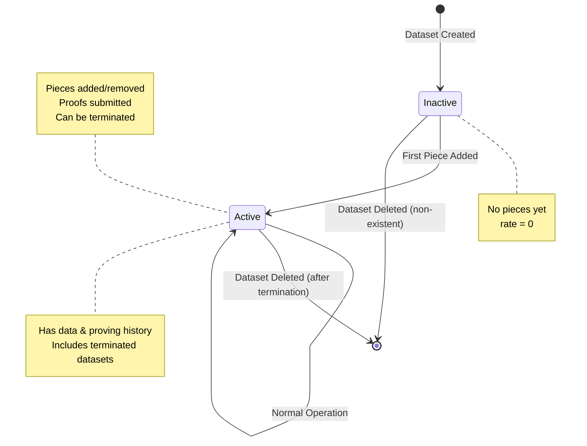

# Dataset Lifecycle and Status

## Overview

Datasets in the Filecoin Warm Storage Service have a simplified two-state lifecycle system that makes it easy for clients, developers, and external systems to understand and track the status of their stored data.

## Status Definitions

### Inactive

A dataset is **Inactive** when:

1. **Non-existent**: Dataset doesn't exist
   - `pdpRailId` = 0
   - Dataset has never been created or has been deleted

2. **Newly Created**: Dataset has been created but no pieces have been added yet
   - `provingActivationEpoch` = 0
   - Payment rate = 0
   - No PDP proving active

### Active

A dataset is **Active** when:

1. **Has Pieces**: At least one piece has been added to the dataset
   - `provingActivationEpoch` > 0
   - PDP proving has been initialized

2. **Including Terminated**: Even terminated datasets remain "Active"
   - Terminated datasets still have data and proving history
   - `pdpEndEpoch` > 0 indicates termination, but status is still Active
   - Active status reflects that the dataset has real data, not operational state

## State Transitions



## State Transition Events

The contract emits a `DataSetStatusChanged` event whenever the status changes:

```solidity
event DataSetStatusChanged(
    uint256 indexed dataSetId,
    DataSetStatus indexed oldStatus,
    DataSetStatus indexed newStatus,
    uint256 epoch
);
```

### When Events Are Emitted

1. **Dataset Creation**: 
   ```solidity
   emit DataSetStatusChanged(dataSetId, Inactive, Inactive, block.number);
   ```
   - Initial status recorded as Inactive

2. **First Piece Added** (Proving Starts):
   ```solidity
   emit DataSetStatusChanged(dataSetId, Inactive, Active, block.number);
   ```
   - Transition from Inactive to Active
   - Triggered in `nextProvingPeriod` when proving is first initialized

**Note**: Service termination does NOT emit a `DataSetStatusChanged` event because the status remains Active (datasets with pieces are always Active, even when terminated). Use the `ServiceTerminated` event to track termination.

## Querying Dataset Status

### 1. From Solidity (On-chain)

#### Direct Contract Call

```solidity
import {FilecoinWarmStorageServiceStateView} from "path/to/view/contract";

contract MyContract {
    FilecoinWarmStorageServiceStateView public viewContract;
    
    function checkDataSetStatus(uint256 dataSetId) public view returns (bool isActive) {
        FilecoinWarmStorageService.DataSetStatus status = 
            viewContract.getDataSetStatus(dataSetId);
        
        return status == FilecoinWarmStorageService.DataSetStatus.Active;
    }
}
```

#### Using State Library (Gas Efficient)

```solidity
import {FilecoinWarmStorageServiceStateLibrary} from "path/to/library";
import {FilecoinWarmStorageService} from "path/to/service";

contract MyContract {
    using FilecoinWarmStorageServiceStateLibrary for FilecoinWarmStorageService;
    
    FilecoinWarmStorageService public service;
    
    function checkStatus(uint256 dataSetId) public view returns (
        FilecoinWarmStorageService.DataSetStatus status,
        bool hasProving,
        bool isTerminated
    ) {
        // Get detailed status information
        return FilecoinWarmStorageServiceStateLibrary.getDataSetStatusDetails(
            service,
            dataSetId
        );
    }
    
    function isActive(uint256 dataSetId) public view returns (bool) {
        return FilecoinWarmStorageServiceStateLibrary.isDataSetActive(
            service,
            dataSetId
        );
    }
}
```

### 2. From Subgraph (Off-chain)

#### Basic Status Query

```graphql
{
  dataSet(id: "0x1234...") {
    setId
    status
    isActive  # Deprecated, use status instead
    totalPieces
    pdpEndEpoch
    createdAt
    updatedAt
  }
}
```

#### Query with Status History

```graphql
{
  dataSet(id: "0x1234...") {
    setId
    status
    statusHistory(orderBy: timestamp, orderDirection: desc) {
      oldStatus
      newStatus
      epoch
      timestamp
      transactionHash
    }
  }
}
```

#### Filter Datasets by Status

```graphql
{
  # Get all active datasets for a payer
  dataSets(
    where: { payer: "0x5678...", status: ACTIVE }
    orderBy: updatedAt
    orderDirection: desc
  ) {
    setId
    status
    totalPieces
    totalDataSize
    serviceProvider {
      name
    }
  }
}
```

#### Status Transition History

```graphql
{
  dataSetStatusHistories(
    where: { dataSetId: "123" }
    orderBy: timestamp
    orderDirection: asc
  ) {
    oldStatus
    newStatus
    epoch
    blockNumber
    timestamp
    transactionHash
  }
}
```

### 3. Via RPC/Web3 (Off-chain)

```javascript
const viewContract = new ethers.Contract(
  VIEW_CONTRACT_ADDRESS,
  VIEW_CONTRACT_ABI,
  provider
);

// Get status enum (0 = Inactive, 1 = Active)
const status = await viewContract.getDataSetStatus(dataSetId);

console.log(`Dataset ${dataSetId} is ${status === 1 ? 'Active' : 'Inactive'}`);
```

## Implementation Details

### Status Calculation Logic

The status is calculated based on two simple factors:

```solidity
function getDataSetStatus(uint256 dataSetId) 
    returns (DataSetStatus status) 
{
    DataSetInfoView memory info = getDataSet(dataSetId);
    
    // Non-existent datasets are inactive
    if (info.pdpRailId == 0) {
        return DataSetStatus.Inactive;
    }
    
    // Check if proving is activated (has pieces)
    uint256 activationEpoch = provingActivationEpoch(dataSetId);
    bool hasProving = activationEpoch != 0;
    
    // Inactive only if no proving has started
    // Everything else is Active (including terminated datasets)
    if (!hasProving) {
        return DataSetStatus.Inactive;
    }
    
    return DataSetStatus.Active;
}
```

**Rationale**: 
- Terminated datasets are still "Active" because they have data and proving history
- The `ServiceTerminated` event and `pdpEndEpoch` field track operational termination
- Status reflects data existence, not operational state

## Use Cases

### 1. Client Dashboard

Display dataset status with appropriate UI:

```javascript
function getStatusBadge(status) {
  if (status === 'ACTIVE') {
    return {
      text: 'Active',
      color: 'green',
      description: 'Data is being actively proven and protected'
    };
  } else {
    return {
      text: 'Inactive',
      color: 'gray',
      description: 'Non-existent or no pieces added yet'
    };
  }
}
```

### 2. Monitoring & Alerts

Set up alerts based on status changes:

```javascript
subscription {
  dataSetStatusChanged(
    where: { dataSetId: "123" }
  ) {
    dataSetId
    oldStatus
    newStatus
    epoch
  }
}

// Alert when dataset becomes inactive
if (newStatus === 'INACTIVE' && oldStatus === 'ACTIVE') {
  sendAlert('Dataset terminated or expired');
}
```

### 3. Conditional Smart Contract Logic

```solidity
contract DataMarketplace {
    function purchaseData(uint256 dataSetId) external {
        // Only allow purchases for active datasets
        require(
            service.isDataSetActive(dataSetId),
            "Dataset must be active"
        );
        
        // Process purchase...
    }
}
```

### 4. Analytics & Reporting

```graphql
{
  # Count active vs inactive datasets
  activeCount: dataSets(where: { status: ACTIVE }) {
    totalCount
  }
  
  inactiveCount: dataSets(where: { status: INACTIVE }) {
    totalCount
  }
  
  # Recent status changes
  recentTransitions: dataSetStatusHistories(
    first: 10
    orderBy: timestamp
    orderDirection: desc
  ) {
    dataSetId
    newStatus
    timestamp
  }
}
```

## Important: Terminated Datasets Remain Active

⚠️ **Key Concept**: Termination does **NOT** change a dataset's status to Inactive. Terminated datasets remain Active until deleted.

### Why?

Status reflects **data existence**, not **operational state**:
- **Active** = "This dataset has data and proving history"
- **Inactive** = "This dataset doesn't exist or has no data"

### Lifecycle of a Terminated Dataset:

```
Dataset Created (no pieces) → Inactive
  ↓
First Piece Added → Active
  ↓
Service Terminated → Active (still has data!)
  ↓
Dataset Deleted → Inactive (now it's gone)
```

### How to Check Operational State:

```solidity
(status, hasProving, isTerminated) = getDataSetStatusDetails(dataSetId);

if (status == Active) {
    if (isTerminated) {
        // Dataset has data but service is terminated
        // No new pieces can be added
        // Payment rails have ended
    } else {
        // Dataset is operational
    }
} else {
    // Dataset doesn't exist or has no pieces
}
```

## Edge Cases & Considerations

### 1. Status During and After Termination

When a dataset is terminated:
- Status remains `Active` (if it had pieces)
- Dataset remains queryable and readable
- `ServiceTerminated` event is emitted to track termination
- `pdpEndEpoch` field indicates when termination occurred
- Payment rails settle during lockup period
- **Status only changes to `Inactive` when dataset is deleted**

### 2. Empty Datasets

Datasets with no pieces:
- Always `Inactive`
- `provingActivationEpoch` = 0
- Can add pieces to transition to `Active`

### 3. Non-Existent Datasets

Datasets that don't exist or have been deleted:
- Status is `Inactive`
- `pdpRailId` = 0
- Cannot be modified or queried for details

### 4. Status Reflects Data, Not Operational State

Important distinction:
- `Active` means "has data and proving history"
- Use `pdpEndEpoch` to check if terminated
- Use `ServiceTerminated` event to track termination
- Terminated datasets can still be `Active` if they have pieces

## Migration from Old Status System

### Old System (3 States)

```solidity
enum DataSetStatus {
    NotFound,    // 0
    Active,      // 1
    Terminating  // 2
}
```

### New System (2 States)

```solidity
enum DataSetStatus {
    Inactive,    // 0
    Active       // 1
}
```

### Mapping

| Old Status | New Status | Condition |
|------------|------------|-----------|
| `NotFound` | `Inactive` | Non-existent dataset |
| `Active` | `Active` | Has pieces (proving activated) |
| `Active` | `Inactive` | No pieces yet |
| `Terminating` | `Active` | Terminated but has pieces |

### Breaking Changes

⚠️ **Important**: This is a breaking change for systems checking status:
- Enum values have changed
- `NotFound` and `Terminating` are removed
- `NotFound` → `Inactive`
- `Terminating` → `Active` (if dataset has pieces)

Update your code:
```solidity
// OLD CODE ❌
if (status == DataSetStatus.NotFound) { ... }
if (status == DataSetStatus.Terminating) { ... }

// NEW CODE ✅
if (status == DataSetStatus.Inactive) {
    // Non-existent or no pieces yet
    // ...
}

// To check if terminated (regardless of status):
(, bool hasProving, bool isTerminated) = 
    service.getDataSetStatusDetails(dataSetId);

if (isTerminated) {
    // Dataset is terminated (but status is still Active if it has pieces)
    // ...
}
```

## Best Practices

1. **Use Status for Business Logic**: Make decisions based on `Active` vs `Inactive`

2. **Use Details for Fine-Grained Control**: When you need to distinguish between different inactive states, use `getDataSetStatusDetails()`

3. **Monitor Status Changes**: Subscribe to `DataSetStatusChanged` events or subgraph subscriptions

4. **Cache Appropriately**: Status can change over time (especially upon termination or deletion)

5. **Batch Queries**: Use subgraph for querying multiple datasets efficiently

6. **Handle Edge Cases**: Always check for edge cases like empty datasets or terminated datasets

## See Also

- [Integration Guide](./integration-guide.md) - How to integrate dataset status into your application
- [API Reference](../README.md) - Complete API documentation
- [Subgraph Schema](../../subgraph/schemas/schema.v1.graphql) - GraphQL schema definition

